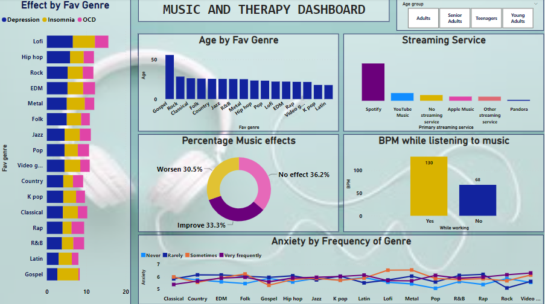
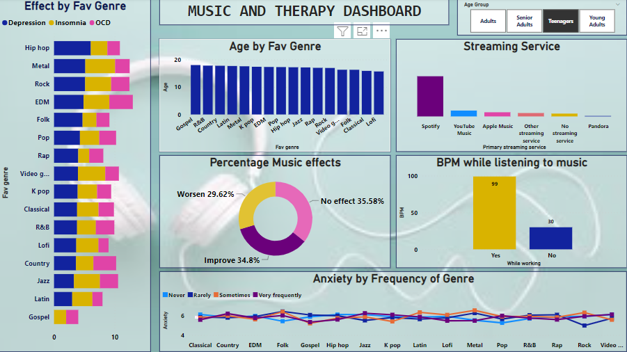
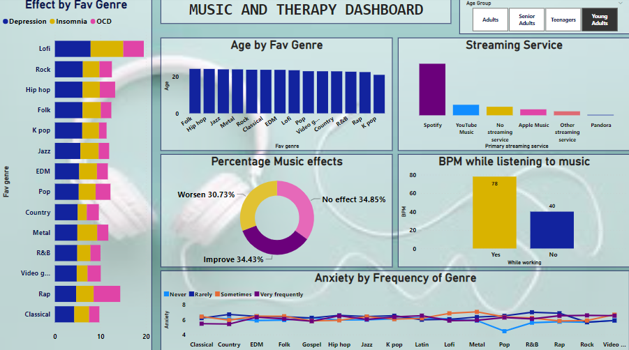
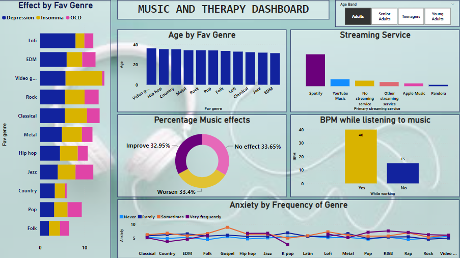
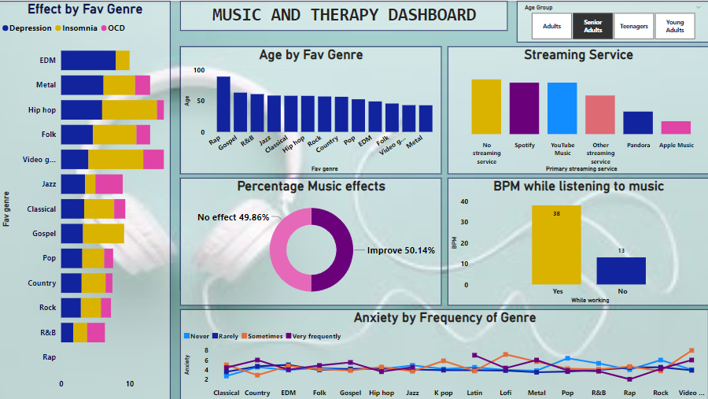

# MUSIC AND THERAPY

---
                                      

---

## DESCRIPTION
Music they say is a food for the soul, this is fast becoming a fact as research says people that listen to music recover faster from stress than those who don’t. Music is therapeutic due to its impact on mental health and general wellbeing. 
This data visualization project was aimed at checking the relationship between music and therapy. The data set was gotten from Quoreos from a survey conducted by JB music on **music and therapy** with its effect of mental health.

## SKILLS DEMONSTRATED
The following power BI skills were incoporated; 
- Replace values.
- Remove errors.
- Sort and filter.
- Page navigation.
- Column reordering.
- Unpivot.
- Creation of conditiona column.

## EXPLANATION OF TERMS
- **Time Stamp:** The time and date that the survey form was filled.
- **Age:** Age of the respondent.
- **Primary streaming service:** The music streaming service used by the respondent.
- **Hours per Day:** Hours respondent spent listening to music.
- **While working:** A ‘Yes’ or ‘No’ answer to if they listen to music while working.
- **Instrumentalist:** A ‘Yes’ or ‘No’ answer to if respondent is an instrumentalist of not.
- **Composer:** A ‘yes’ or ‘No’ answer to if respondent is an instrumentalist or not.
- **Favourite Genre:** Favourite genre of respondent.
- **Foreign language:** A ‘Yes’ or ‘No’ answer to if they speak foreign language or not.
- **BPM:** Heart rate measured in Beat Per Minute.
- **Frequency (music type):** How often they listen to the stated music type; never, rarely, sometimes and very often.
- **Anxiety:** Level of anxiety measured from 1-10.
- **Depression:** Level of depression measured from 1-10.
- **Insomnia:** Insomnia measured between 1-10.
- **OCD:** (Obsessive Compulsive Disorder) Level measured from 1-10.
- **Music Effect:** The effect of music on their health conditions; ”No effect”, “Worsen”, “Improve”.
- **Permission:** Consent to share respondent responses.

## PROCESS
The data was loaded into power query for cleaning and transformation, then scrolled through to glance and check the dataset for errors, blanks and also ensure that the columns are in the right format before fully proceeding into data cleaning after which it was loaded into power BI.
During the data cleaning, age band was created using conditional columns and slicers was creaated using the age band created. The age band are as follows;
1.	Less than 19: Teenagers
2.	Between 20-30: Younger Adults
3.	Between 31 and 40: Adults 
4.	41 and above: Senior Adults

## CHART DESCRIPTION/ INSIGHT GENERATED
1.	Average depression, insomnia and OCD compared with individual favorite genre: The rate of Depression, Insomnia and OCD with respect to the kind of music respondents listen to.
2.	Average age by genre: This shows that more people listen to gospel than any other genre of music.
3.	Most used streaming service by recipients: This chart shows that the most used streaming service across the chart is Spotify followed by YouTube music but when filtered by the adult filter, it shows that majority of the adults don’t used any streaming service when listening to music.
4.	% of music effect: this is shows close relationship in the music effect.  Over 100 we have 30.5% worsen cases, 33.3% improved cases and 36.2% had no effect. 
5.	BPM while listening to music: This shows that the Heart rate per minute increased when listening to music while working while it reduced when no listening to music at work
6.	Anxiety by Frequency of Genre: This shows the rate of anxiety among recipients according to their Favourite genre.

**LESS THAN 19: TEENAGER** 

**BETWEEN 20 AND 30: YOUNGER ADULTS** 

**Between 31 AND 40: ADULTS** 

**AGE 41 AND ABOVE: SENIOR ADULTS** 

*THANKS FOR READING*
